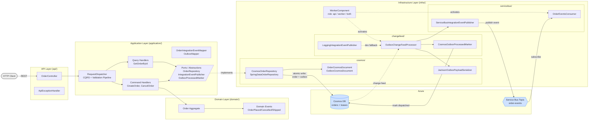

# Architecture

## Flow

- **Write path:** `OrderController` → CQRS dispatcher → command handler → `Order` aggregate → `CosmosOrderRepository` writes the order document and outbox record to Cosmos DB in a single transactional batch.
- **Outbox dispatch:** `OutboxChangeFeedProcessor` reads the Cosmos Change Feed (coordinated via the `leases` container) → `IntegrationEventPublisher` publishes to the Service Bus topic `order-events` → `CosmosOutboxProcessedMarker` marks the outbox record as dispatched.
- **Consume:** `OrderEventsConsumer` subscribes to the Service Bus topic.
- **Roles:** `WorkerComponent` activates the change feed processor and/or consumer based on the `APP_ROLE` profile (`api` / `worker` / `both`).